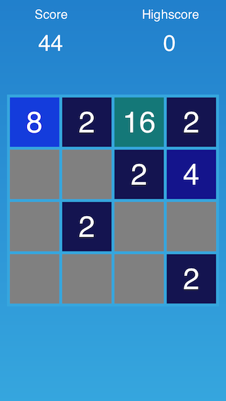

2048-SpriteBuilder-Tutorial
===========================
A Tutorial that explains how to build 2048 from scratch - using SpriteBuilder and Cocos2D: https://www.makeschool.com/tutorials/build-your-own-2048-with-spritebuilder-and-cocos2d

